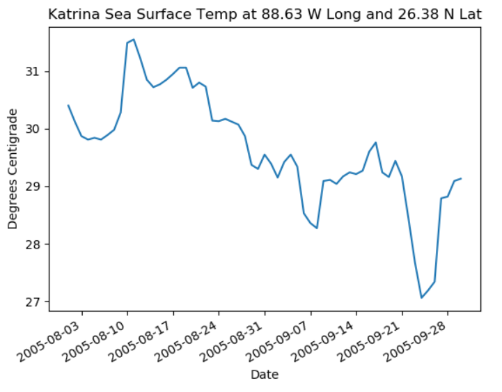

# NASA data analysis and visualization of Hurricane sea surface temperatures

This program analyzes sea surface temperates for several hurricanes using publically available NASA data.

It can produce 2D and 3D plots of temperature.

## Examples

Hurricane Katrina 3D plot:
 

Hurricane Isaac 3D plot:
 

Hurricane Rita 3D plot:
 

---

Hurricane Katrina 2D plot:
 

Hurricane Isaac 2D plot:
 

Hurricane Rita 2D plot:
 

